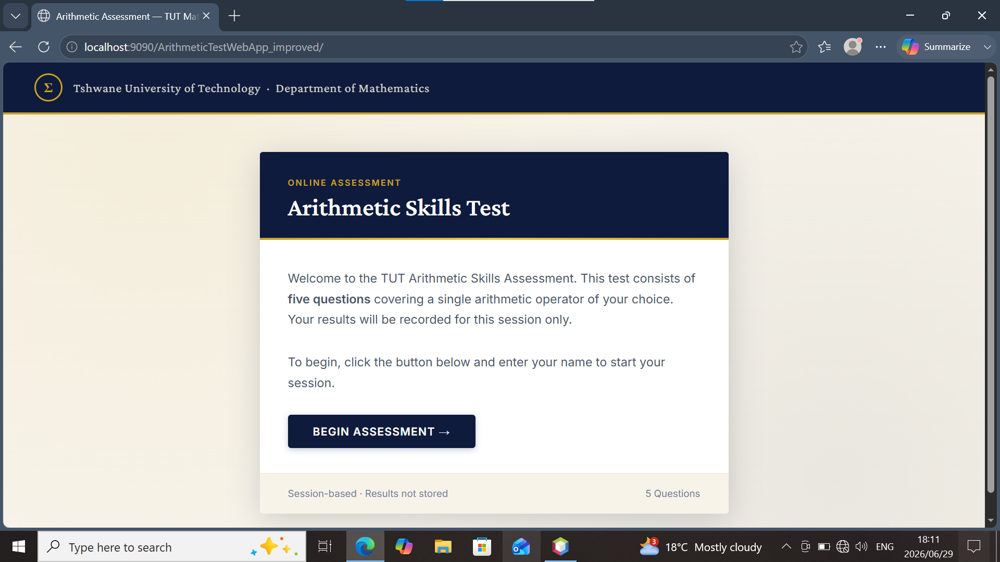
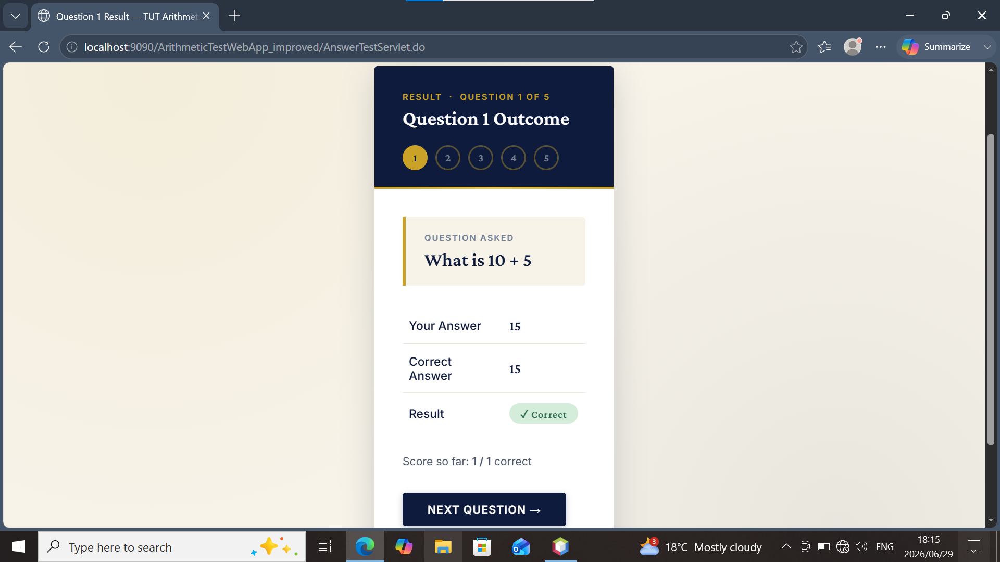
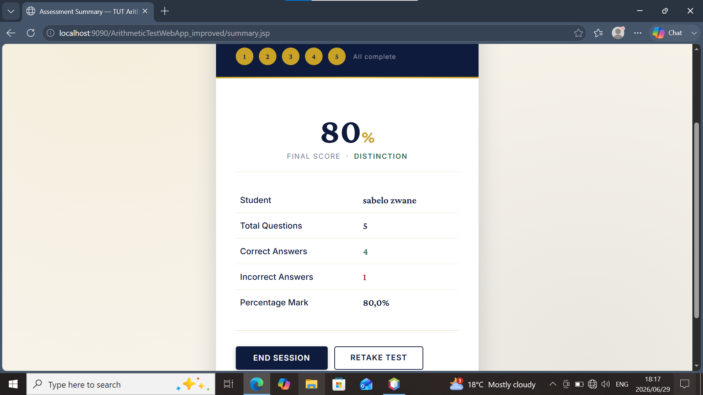

# 🧮 Arithmetic Test Web App

A Java-based interactive arithmetic assessment web application that allows users to test their mathematical skills through dynamically generated questions.

The system enables users to select an arithmetic operator, complete a generated test, submit answers, and receive an automatically calculated performance summary.

Built using **Java Servlet technology, JSP, HTML5, and CSS3**, this project demonstrates full-stack Java web development concepts including server-side processing, session management, and responsive user interface design.

---

## 🚀 Features

✅ Interactive arithmetic testing system  
✅ User-selected arithmetic operators  
✅ Randomly generated questions  
✅ Answer submission and validation  
✅ Session-based test tracking  
✅ Automatic score calculation  
✅ Final results summary page  
✅ Academic examination-style interface  
✅ Responsive web design  

---

## 🛠️ Technologies Used

### Backend Development

- Java
- Java Servlets
- JSP (JavaServer Pages)
- Jakarta Servlet API

### Frontend Development

- HTML5
- CSS3
- Google Fonts

### Development Tools

- NetBeans IDE
- Apache Ant
- GlassFish Server

---

## 📚 Concepts Implemented

- Object-Oriented Programming (OOP)
- HTTP Request and Response Handling
- Session Management
- Form Processing
- Input Validation
- Dynamic Content Rendering

---

## 📂 Project Structure

```text
ArithmeticTestWebApp/

│
├── screenshots/
│   ├── home-page.png
│   ├── test-page.png
│   └── results-page.png
│
├── src/
│   └── java/
│       └── Servlets/
│
├── web/
│   ├── JSP Pages/
│   ├── HTML Pages/
│   └── CSS Styling/
│
└── nbproject/
    └── NetBeans Configuration
```

---

## ▶️ How To Run

Clone the repository:

```bash
git clone <repository-url>
```

Open the project in:

```text
NetBeans IDE
```

Configure:

```text
GlassFish Server
```

Build and run the application.

---

# 📸 Screenshots

## 🏠 Home Page



---

## 📝 Arithmetic Test Page



---

## 📊 Results Summary Page



---

## 🔮 Future Improvements

- Database integration
- User accounts and authentication
- Store previous test results
- Difficulty levels
- Timer feature
- Administrator dashboard
- Accessibility improvements

---

## 👨‍💻 Developer

**Sabelo Malusi Zwane**

Java Developer | Web Application Developer

Skills:

- Java
- JSP & Servlets
- HTML
- CSS
- Git & GitHub
